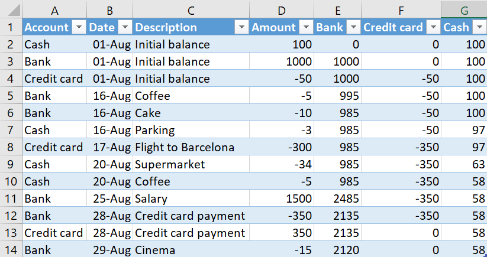

# Money Scout - Tracking your money flow
Keeping track of your income and expenses is the first step toward a healthy and sustainable financial future. If you know how much money you earn and spend, where it comes from and where it goes, you can start making decisions about it. How do you feel about your expenses?  Any surprises? Are you spending more or less than you earn?

This award relates to tracking your cash flows over time. Find out how you can get the award and get help setting up your system.

## Get the Money Scout award
This award comes with multiple levels. Read below how to get the achievements.

### Money Scout level 1
Write down your income and expenses for one month. You can use any tool you like, such as Excel, an app in your phone or pen and paper. The only thing you must make sure is that you catch everything. Count your coins and notes at the start of the month and the end of the month to find any cash expenses you missed, since this is a common thing that happens.

### Money Scout level 2
Track your income and expenses for three months and divide them into categories. Use the information you collect to predict your total expenses for a whole year. Decide whether you are happy about your income and expenses and their relationship and if you would like to make any changes. Optionally consider creating budgets for the categories and try spending within the budget for a while.

### Money Scout level 3
Create a system for tracking your income and expenses and use it for a year. The system should be digital so you can use it to calculate monthly averages from your yearly overview, find the largest expenses and largest categories, etc. There are computer programs to help you, or you can create an Excel workbook.

## How to track your money flow
To track your money flow you must create a list of all the money you receive and all the things you pay for. You do this in two steps:

1. Make a list of all accounts you have, including cash.
2. Write down all changes to those accounts over time.

The first step is a one time activity, while the second step is an ongoing one. Let's have a look at both, and then an example.

### Create a list of your accounts
This step to tracking your expenses is closely related to the [Valued Player award](valued_player): get a list of the places from which you are spending money. This can be as simple as a single bank account, and the cash in your wallet. Perhaps you have multiple bank accounts, or credit cards. Even though you may only pay down your credit card debt every now and then, it is important to consider the money as spent as soon as you pay for it with your credit card. This means each credit card should be a separate account.

It may not be worth it to keep track of some accounts. For example, you may have a card you load money onto to pay for public transport. Technically, that money is still yours until you actually take a bus or train with it, but do you really want to keep track of all this? You can. You can also consider the money spent as soon as you wire it to the card. If you do not use cash a lot, you can even consider money gone as soon as you take it out of the ATM, and ignore the cash account. This hides your cash expenses, so carefully consider whether you want to do this or not.

### Track all changes to your accounts
This is the important step that will give you insight into your expenses! The goal is to know at the end of every month exactly where your money went. Most of this process can be automatic, at least for digital transactions from your bank accounts. Whenever you use cash, you must write these expenses down manually.

I strongly recommend you write your expenses down digitally, in the computer or an app. You can write them down on paper, but this makes it difficult to calculate totals later. You will have to enter every number into a calculator or add them up in your head if you want to know the total amount you spent at the supermarket, for example. You cannot sort data on paper either, unless you define your categories from the start.

There really are two categories of money here: cash and digital. Cash is difficult because you must manually write down every expense and every time someone gives you money. This means you need to remember to do this almost every day if you use a lot of cash. If you often forget to do this, I recommend you try to use your debit card more often. You must write down the money which "disappeared" as well, even though you may not know where it went. At the end of the month the numbers must add up. Take the cash you had at the beginning of the month, add and subtract all the money you received and spent, and you should end up with the amount you have at the end of the month. If it is not right, you must correct it by adding a correction expense.

Digital money is easy because you only have to think of it once per month. At the end of the month, or whenever you want to update your overview, you simply log on to your banking website and copy the list of transactions into your overview. There are computer programs and mobile apps which you can connect to your bank, so you do not have to do anything except clarify what some transactions are. If you truly do all your spending using a single bank account, you may even be able to use your bank website if they provide some tool. If you use multiple banks or use cash a lot, you cannot use this solution because all data should be in the same tool.

### Example - Excel
You can start tracking your expenses today using a single simple Excel table. You can create your own, or build on a [simple cash flow example Excel file](../tools/simple_cash_flow.xlsx) from FPPA. The screenshot below shows the contents of the Excel file.

To work with this table yourself, you perform two steps. First, create your own accounts:

- Simply rename a column such as `Bank` to the name of your account.
- Delete columns such as `Credit card` if you do not have such an account.
- Add a column called for example `PayPal` if you have such an account and copy the contents from one of the existing accounts to the cell on the same row in your new column.

Now you must create a single row with a transaction for each of the accounts to put the initial balance in there. If the account has a positive balance, write a positive number, such as 1000 for the `Bank` account in the example. If the account has negative balance, write a negative number, such as `-50` for the `Credit card` account in the example. The date you use should be the date you start keeping track of your money, maybe today!

Now, start using the table to keep track of your income and expenses. Simply write the account for which you want to add a transaction in the `Account` column, the date in the `Date` column, the description of the transaction in the `Description` column and the amount, positive for income and negative for expenses, in the `Amount` column. The rest of the columns should automatically calculate the correct new balance.

You can just keep typing at the bottom of the table; it will automatically expand. You can delete rows and filter the table if you like.

The table must always be sorted by date, with time going up as you go down the table. You can add lines out of order, but then you must sort or the calculations will be incorrect. After updating and sorting the table the bottom row will always show the current balance of all your accounts.

There is one special kind of transaction in the example: the credit card payment. When you send money from one account to another account, such as for a credit card payment or when you take cash from an ATM, you write this in two lines. One line shows the money leaving one account, and the other line shows the money arriving in the other account. The order does not matter.

## Useful information from your money flow
Coming soon.